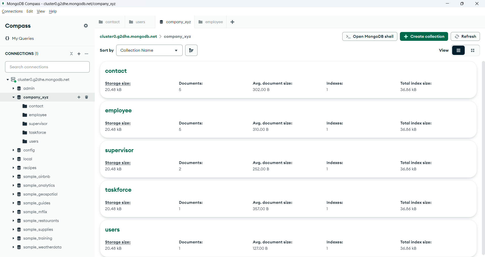

<!-- .md means markdown -->

<!-- README.md -->
<!-- This file documents the information about the portfolio project. -->
<!-- It should be READ ME first!!! -->

<!-- Heading level 1 -->
# BELLS-TEST-4
**(SCTP) Full Stack Developer**

Module 6: **Datacentric Development**

***Project Assignment - Portfolio***

<!-- Heading level 3 -->
### Project File Structure:

* JavaScript Files

>>> Employees NoSQL-Database System
: 

* src Folder (Sources Root)
: index.js
: .env
: gitignore
: README.md
: package.json
: package-lock.json

* IMG Folder (images)
: eds-database.png
: eds-get.png
: eds-post.png
: eds-put.png
: eds-delete.png


<!-- Heading level 1 -->
# Project Guide
For the purpose of the portfolio project, a RESTful-API-driven datacentric application is created for the following:

```json
{
1. "CRUD Datacentric Application via HTTP-methods" : in our case "Employees NoSQL-Database System"
}
```

This project is about a simple *Employees NoSQL-Database System (EDS)* at **BELLS** using the concepts we learned in the Recipes Book System Express/MongoDB lab. Instead of managing a database of recipes, we'll be managing a database of employees in a company.

POST => C = Create: adding new data to the database   
GET => R = Read: get existing information   
PUT => U = Update: update existing information in the database   
DELETE => D = Delete: remove existing information from the database

Using MongoDB to store our database:

-XYZ : represents the entire company database\
employee collection: represents the documents related to employees\
supervisor collection: represents the documents related to supervisor\
taskforce collection: represents the documents related to taskforce 


The application of this project caters to the needs of a specific target user group, the company executives,
who are looking for a datacentric system to query the employees' particulars and their links to supervisor and taskforce.

The application provides a one-stop entry point to the database management of employees information, namely:

***
employee (Basic Info)
1. *Employee ID*
2. *Name*
3. *Designation*
4. *Department*
5. *Address*
6. *Data Joined*
7. *Supervisor*
***

***
supervisor (Additional Info)
1. *supervisor name*
2. *review report*
3. *rank*
***

***
taskforce (Additional Info)
1. *member name*
2. *role*
***

This simple software is a server-side (backend) application for Employees NoSQL-Database System.

It provides RESTful API endpoints for access using HTTP methods (like GET, POST, PUT and DELETE) to obtain the data from MongoDB NoSQL database system.

It also has a simple authorization security implemented using JSON Web Token (JWT).




<!-- Heading level 4 -->
#### The source codes is hosted as public on a [GitHub] [1] repository and the link is as follows: 

- [Source Codes GitHub Link](https://www.github.com/ngys9919/bells-test-4 "My source-codes!")
: Click the hyperlink <https://www.github.com/ngys9919/bells-test-4>

- [RESTful API GitPod Link](https://ngys9919-bellstest4-ow3nfwhphp2.ws-us116.gitpod.io/ "My RESTful API endpoints!")
: Click the hyperlink <https://ngys9919-bellstest4-ow3nfwhphp2.ws-us116.gitpod.io/>


<!-- Heading level 2 -->
## Features

<!-- Heading level 3 -->
### Existing Features


<!-- Heading level 3 -->
### Future Implementation
The application could expand to include Front-End Development and new features like Dynamic Web Rendering using HandleBars (hbs) of Express, and Enhanced Security with Refresh Token in the Employees NoSQL-Database System.

<!-- Heading level 2 -->
## Testing
1. Using Test-Cases\
   1.1 


<!-- Heading level 2 -->
## Credits

### Acknowledgements
Thanks to Bells for support!

<!-- Heading level 2 -->
## About
> This project work, part of **Module 6: Datacentric Development**, 
> is an individual assessment done by Candidate’s Name (as in NRIC): **Ng Yew Seng** (Candidate’s NRIC: **S XXXX 3 5 3 / F**), 
> a trainee under the **(SCTP) Full Stack Developer** course, organized by **Bells Institute of Higher Learning**. 

>>
>> Coder: ***Ng Yew Seng***\
>> © Copyright 2024\
>> Bells Institute of Higher Learning


<!-- Heading level 2 -->
## Technologies Used
- [x] GitPod Cloud-hosted IDE
- [x] MongoDB
- [x] node/npm
- [x] express
- [x] cors
- [x] dotenv
- [x] bcrypt
- [x] jsonwebtoken


<!-- Heading level 2 -->
## References
1.  [GitPod](https://gitpod.io)

2.  [Microsoft GitHub](https://www.github.com)

3.  [Bells Institute of Higher Learning](https://bells.sg)

<!-- hyperlinks -->
[1]: https://github.com "GitHub"