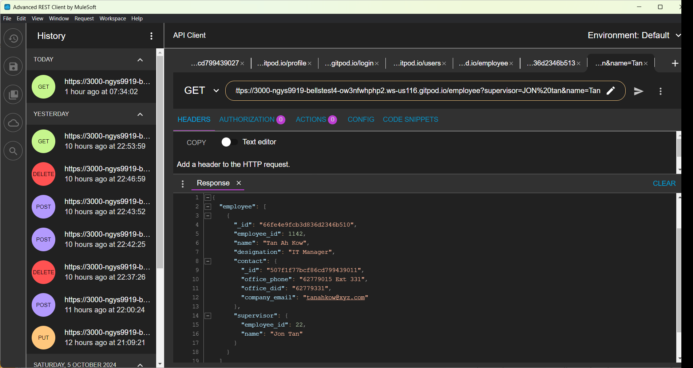
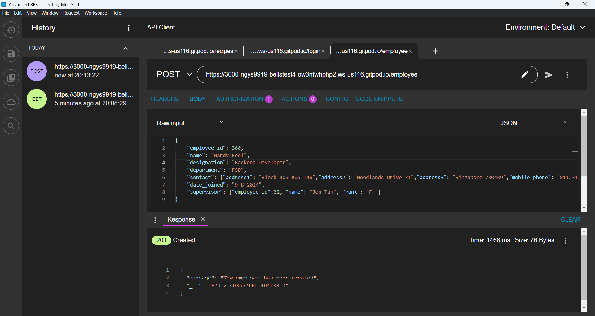
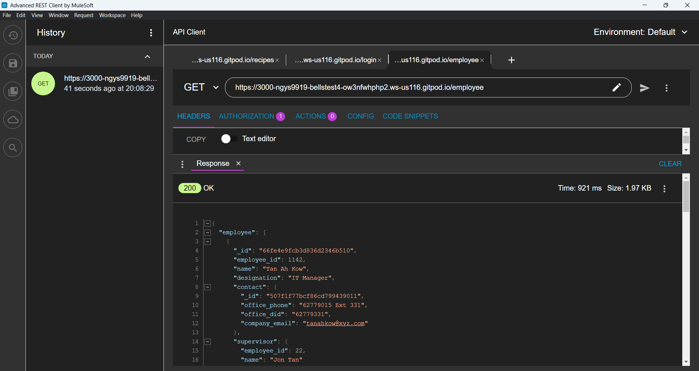
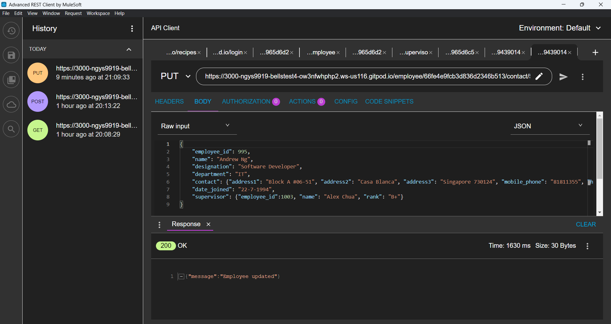
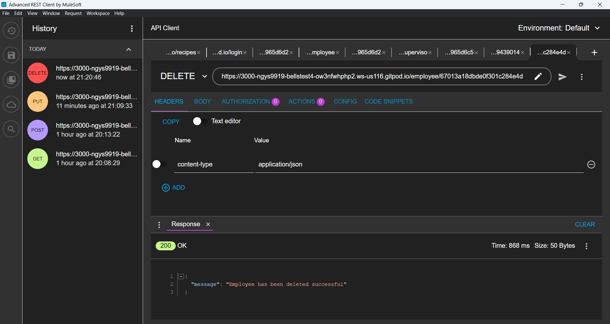

<!-- .md means markdown -->

<!-- README.md -->
<!-- This file documents the information about the portfolio project. -->
<!-- It should be READ ME first!!! -->

<!-- Heading level 1 -->
# BELLS-TEST-4
**(SCTP) Full Stack Developer**

Module 6: **Datacentric Development**

***Project Assignment - Portfolio***

<!-- Heading level 3 -->
### Project File Structure:

* JavaScript Files

>>> Employees NoSQL-Database System
: 

* BELLS-TEST-4 Folder (Sources Root)
: index.js
: .env
: gitignore
: README.md
: package.json
: package-lock.json

* IMG Folder (images)
: Screenshot npm-init-y.png
: Screenshot npm-install-1.png
: Screenshot npm-install-2.png
: eds-database.png
: eds-search-employee-supervisor-name.png
: POST-Create.png
: GET-Read.png
: PUT-Update.png
: DELETE-Delete.png
: jwt-users.png
: jwt-login.png
: jwt-profile.png
: jwt-DELETE.png
: wo-jwt-DELETE.png

* JSON Folder (json)
: q6-employees.md
: employee.json
: contact.json
: supervisor.json
: taskforce.json


<!-- Heading level 1 -->
# Project Guide
For the purpose of the portfolio project, a RESTful-API-driven datacentric application is created for the following:

```json
{
1. "CRUD Datacentric Application via HTTP-methods" : in our case "Employees NoSQL-Database System"
}
```

This project is about a simple *Employees NoSQL-Database System (EDS)* at **BELLS** using the concepts we learned in the Recipes Book System Express/MongoDB lab. Instead of managing a database of recipes, we'll be managing a database of employees in a company.

POST => C = Create: adding new data to the database   
GET => R = Read: get existing information   
PUT => U = Update: update existing information in the database   
DELETE => D = Delete: remove existing information from the database

Using MongoDB to store our database:

- company-xyz : represents the entire company database\
employee collection: represents the documents related to employees\
contact collection: represents the documents related to contact\
supervisor collection: represents the documents related to supervisor\
taskforce collection: represents the documents related to taskforce 


The application of this project caters to the needs of a specific target user group, the company executives,
who are looking for a datacentric system to query the employees' particulars and their links to supervisor and taskforce.

The application provides a one-stop entry point to the database management of employees information, namely:

***
employee (Basic Info)
1. *employee_id*
2. *name*
3. *designation*
4. *department*
5. *contact* [
6. *_id*,
7. *office_phone*,
8. *office_did*,
9. *company_email* ]
10. *date_joined*
11. *supervisor* [
12. *employee_id*,
13. *name* ]
***

***
contact (Supplementary Info)
1. *_id*
2. *address1*
3. *address2*
4. *address3*
5. *mobile_phone*
6. *home_phone*
7. *office_phone*
8. *office_did*
9. *personal_email*
10. *company_email*
***

***
supervisor (Additional Info)
1. *employee_id*
2. *supervisor name*
3. *review report* [
4. *employee_id*,
5. *name*,
6. *rank* ]

***

***
taskforce (Additional Info)
1. *_id*
2. *members* [
3. *employee_id,*
4. *name,*
5. *role* ]
***

This simple software is a RESTful API application for Employees NoSQL-Database System.

It provides RESTful API endpoints for access using HTTP methods (like GET, POST, PUT and DELETE) to obtain the data from MongoDB NoSQL database system.













It also has a simple authorization security implemented using JSON Web Token (JWT).


<!-- Heading level 4 -->
#### The source codes is hosted as public on a [GitHub] [1] repository and the link is as follows: 

- [Source Codes GitHub Link](https://www.github.com/ngys9919/bells-test-4 "My source-codes!")
: Click the hyperlink <https://www.github.com/ngys9919/bells-test-4>

- [RESTful API GitPod Link](https://ngys9919-bellstest4-ow3nfwhphp2.ws-us116.gitpod.io/ "My RESTful API endpoints!")
: Click the hyperlink <https://ngys9919-bellstest4-ow3nfwhphp2.ws-us116.gitpod.io/>


<!-- Heading level 2 -->
## Features

<!-- Heading level 3 -->
### Existing Features
The following routes are implemented with its related features:

For database access:

1. /taskforce&ensp;&ensp;&ensp;&ensp; GET, PUBLIC, This route can get the complete taskforce list and perform searches using query string with members, with regular expression (^,$,.*), implicit setting 'i' for case-insensitive.

2. /supervisor&ensp;&ensp;&ensp;&ensp; GET, PUBLIC, This route can get the complete supervisor list and perform searches using query string with name, with substring search, case insensitive.

3. /contact&ensp;&ensp;&ensp;&ensp; GET, PUBLIC, This route get the complete contact list and has no search.

4. /employee&ensp;&ensp;&ensp;&ensp; GET, PUBLIC, This route can get the complete employee list and perform searches using query string with name and supervisor and combined, with substring search, case insensitive.

5. /employee/:id&ensp;&ensp;&ensp;&ensp; GET, PUBLIC, This route can retrieve the specified employee and display the detailed info on the employee with the provided _id using BSON format.

6. /employee&ensp;&ensp;&ensp;&ensp; POST, PUBLIC, This route can create an employee record with the provided info using JSON format, with fields name, employee_id, designation, department, contact, date_joined and supervisor.

7. /employee/:id/contact/:contactId/supervisor/:supervisorId&ensp;&ensp;&ensp;&ensp; PUT, PUBLIC, This route can update the employee and its contact and supervisor info with their respective _id using BSON format, with fields name, employee_id, designation, department, contact, date_joined and supervisor.

8. /employee/:id&ensp;&ensp;&ensp;&ensp; DELETE, PROTECTED, This route can delete the employee record with the provided _id using BSON format.

<br/>

For authorization:

1. /users&nbsp;&nbsp;&nbsp;&nbsp; POST, PUBLIC, This route is used for user registration with provided email and password using JSON format.

2. /login&nbsp;&nbsp;&nbsp;&nbsp; POST, PUBLIC, This route is used to login with email and obtain the accessToken for protected access to resource like delete and profile routes.

3. /profile&nbsp;&nbsp;&nbsp;&nbsp; GET, PROTECTED, This route is used to read the registered user info with info like user_id (hashed), email, iat (issued at) and exp (expiry time).


<!-- Heading level 3 -->
### Future Implementation
The application could expand to include Front-End Development and new features like Dynamic Web Rendering using HandleBars (hbs) of Express, and Enhanced Security with Refresh Token in the Employees NoSQL-Database System.

<!-- Heading level 2 -->
## Testing
For testing of GET route, we could just use the web browser, either on local host when using the Visual Studio Code to run the server or on internet url when using the cloud-based hosting platform like GitPod to run. For testing of POST, PATCH, PUT and DELETE routes, we will need to use a REST client. There are a number of HTTP clients available for us to use, such as Postman, Insomnia etc. However, a simpler alternative is to use the Advanced Rest Client (or ARC for short). In our case, GitPod and ARC are used in the testing process. 

\<port\> = 3000

\<server url\> = 3000-ngys9919-bellstest4-ow3nfwhphp2.ws-us116.gitpod.io

1. Using Test-Cases

>>1.1  Test the search engine function: Run the server, and in your browser, test with the following query strings:

   For taskforce collection:\
   Search by members: https://<server url>/taskforce?members=JoN\
   Search by members: https://<server url>/taskforce?members=Alex%20CHUA\
   Search by members: https://<server url>/taskforce?members=^A\
   Search by members: https://<server url>/taskforce?members=CHua$\
   Search by members: https://<server url>/taskforce?members=^AnDREW NG$\
   Search by members: https://<server url>/taskforce?members=A.*hu

   For supervisor collection:\
   Search by name: https://<server url>/supervisor?name=jon%20tan

   For contact collection:\
   No Search for contact.

   For employee collection:\
   Search by supervisor: https://<server url>/employee?supervisor=JON%20tan\
   Search by name: https://<server url>/employee?name=jon tan\
   Combine multiple search criteria: https://<server url>/employee?supervisor=JON%20tan&name=Tan

>>1.2 Test the read function on database collections:

   For taskforce collection: https://<server url>/taskforce\
   For supervisor collection: https://<server url>/supervisor\
   For contact collection: https://<server url>/contact\
   For employee collection: https://<server url>/employee

>>1.3 Test the CRUD functions:

>>>1.3.1 Test the create function: To test the create route, we use ARC to send a POST request to https://<server url>/employee.\
   Make sure to provide the following in the body as JSON:

```json
   {
    "employee_id": 380,
    "name": "Hardy Fool",
    "designation": "Backend Developer",
    "department": "FSD",
    "contact": {"address1": "Block 409 #06-146","address2": "Woodlands Drive 71","address3": "Singapore 730409","mobile_phone": "81123111","home_phone": "12348765","office_phone": "62779015 Ext 876","office_did": "62779876","personal_email": "hardyfool@yahoo.com.sg","company_email": "hereng@xyz.com"},
    "date_joined": "9-8-2024",
    "supervisor": {"employee_id":22, "name": "Jon Tan", "rank": "F-"}
   }
```
>>>1.3.2 Test the read function: To test the read route, we use ARC to send a GET request to https://<server url>/employee/<_id>.

>>>1.3.3 Test the update function: To test the update route, we use ARC to send a PUT request to https://<server url>/employee/<_id>//contact/<contactId>/supervisor/<supervisorId>. Make sure to provide the following in the body as JSON:

```json
   {
    "employee_id": 995,
    "name": "Andrew Ng",
    "designation": "Software Developer",
    "department": "IT",
    "contact": {"address1": "Block A #06-51", "address2": "Casa Blanca", "address3": "Singapore 730124", "mobile_phone": "81811355", "home_phone": "63229856", "office_phone": "62779015 Ext 222", "office_did": "62779222", "personal_email": "andyng909@gmail.com.sg", "company_email": "andrewng@xyz.com"},
    "date_joined": "22-7-1994",
    "supervisor": {"employee_id":1003, "name": "Alex Chua", "rank": "B+"}
   }
```
>>>1.3.4 Test the delete function: To test the delete route, we use ARC to send a DELETE request to https://<server url>/employee/<_id>. Make sure to setup the bearer and provide its accessToken since this is a protected route.

>>1.4 Test the JWT function:

>>>1.4.1 Test the user registration function: To test the user route, use ARC and send a POST request to https://<server url>/users. Make sure to provide the email and password in the body as JSON.

```json
   {
      "email": "ngys9919@yahoo.com",
      "password": "ngys1234"
   }
```

>>>1.4.2 Test the login function: To test the login route, use ARC and send a POST request to https://<server url>/login. Make sure to provide the email and password in the body as JSON. By using /login, if the user has registered an account, the accessToken will be provided via this route.

>>>1.4.3 Test the profile function: To test the profile route, use ARC and send a GET request to https://<server url>/profile. Make sure to setup the bearer and provide its accessToken since this is a protected route.


<!-- Heading level 2 -->
## Credits

### Acknowledgements
Thanks to Bells for support!

<!-- Heading level 2 -->
## About
> This project work, part of **Module 6: Datacentric Development**, 
> is an individual assessment done by Candidate’s Name (as in NRIC): **Ng Yew Seng** (Candidate’s NRIC: **S XXXX 3 5 3 / F**), 
> a trainee under the **(SCTP) Full Stack Developer** course, organized by **Bells Institute of Higher Learning**. 

>>
>> Coder: ***Ng Yew Seng***\
>> © Copyright 2024\
>> Bells Institute of Higher Learning


<!-- Heading level 2 -->
## Technologies Used
- [x] GitPod Cloud-hosted IDE
- [x] mongodb: enables connecting to database
- [x] node/npm: create the Node application with node package manager for installing packages
- [x] express: creates a HTTP server
- [x] cors: enables cross origin resources sharing
- [x] dotenv: stores sensitive information in a .env file
- [x] bcrypt: allows the hash of our password
- [x] jsonwebtoken: create a JWT (JSON Web Token) for access control to protected resources


<!-- Heading level 2 -->
## References
1.  [GitPod](https://gitpod.io)

2.  [Microsoft GitHub](https://www.github.com)

3.  [Bells Institute of Higher Learning](https://bells.sg)

<!-- hyperlinks -->
[1]: https://github.com "GitHub"